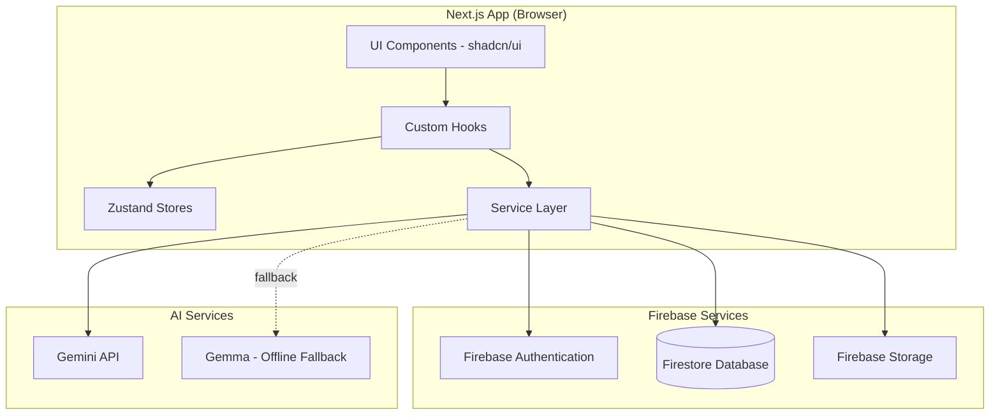
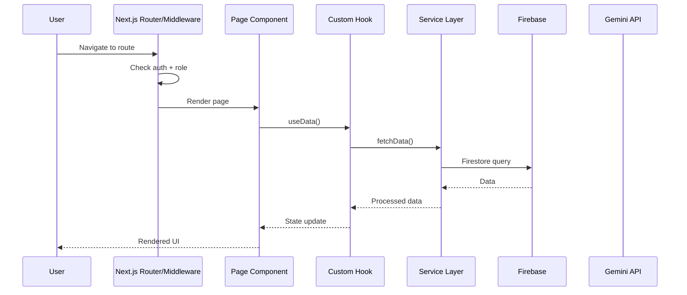
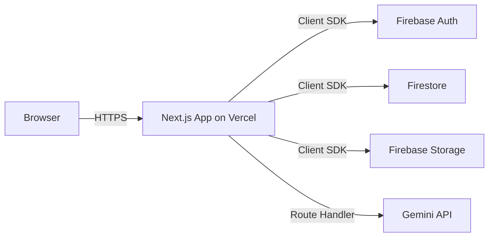
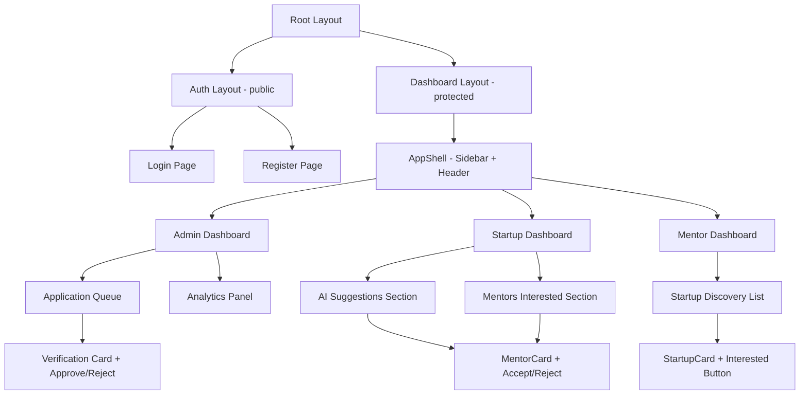
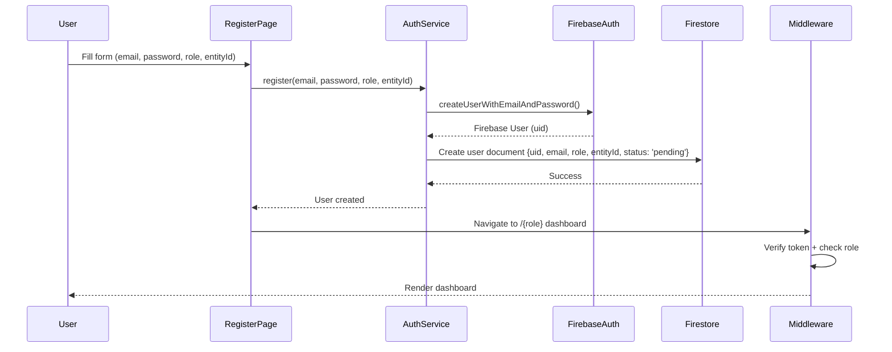
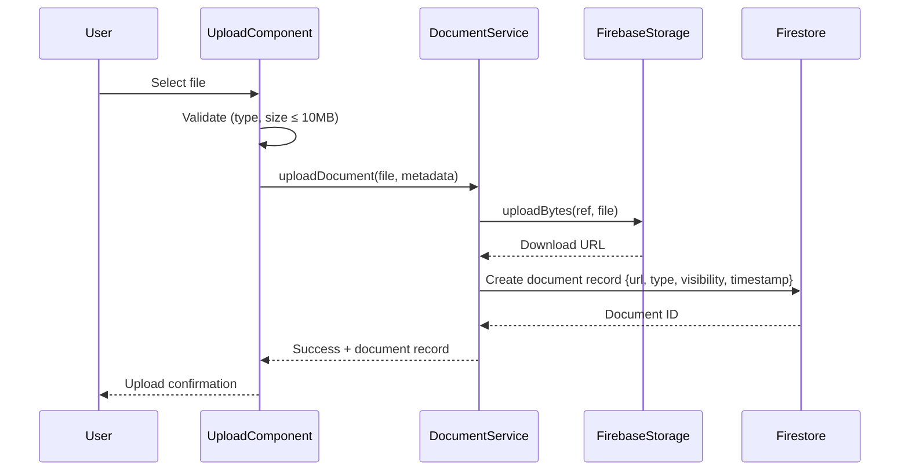
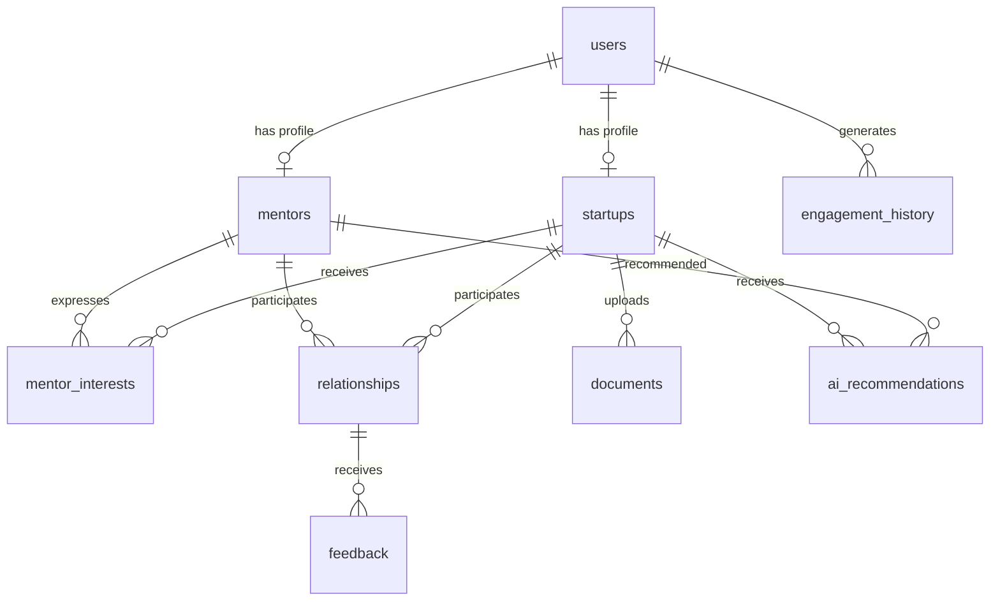

# Design Document: Nexora Platform

## Overview

Nexora is an AI-powered ecosystem relationship intelligence platform that connects startups with mentors through a hybrid matching marketplace. The platform combines AI-generated recommendations (via Gemini API) with organic mentor interest expressions, giving startups final authority over mentor selection.

The system is built as a client-side Next.js App Router application with Firebase as the backend (Authentication, Firestore, Storage). There are no Cloud Functions — all logic runs client-side or through direct API calls to the Gemini API. The architecture prioritizes simplicity: a single Next.js deployment handles all routing, rendering, and service orchestration.

Key design decisions:
- **Client-side Firebase**: All Firestore reads/writes happen directly from the browser using Firebase client SDK with security rules for access control
- **No Cloud Functions**: Business logic lives in client-side service modules; AI calls go directly to Gemini API from the client
- **Zustand for state**: Lightweight stores for auth state, UI state, and cached data — created per-request to avoid SSR hydration issues
- **Role-based routing**: Next.js middleware + layout-level auth checks enforce role access
- **Light mode only**: Single theme reduces complexity and ensures consistent professional appearance

## Architecture

### System Architecture Diagram



### Request Flow



### Deployment Architecture

The application deploys as a single Next.js application (e.g., on Vercel or similar). Firebase services are consumed directly from the client. The Gemini API key is stored as an environment variable and used in Next.js Route Handlers (API routes) to avoid exposing it to the browser.



**Rationale for Route Handlers for AI**: While the constraint is "no Cloud Functions," Next.js API Route Handlers run as serverless functions within the same deployment. They protect the Gemini API key from client exposure and allow rate limiting. This is distinct from Firebase Cloud Functions.

## Components and Interfaces

### Folder Structure

```
/src
  /app                      # Next.js App Router pages and layouts
    /(auth)                 # Auth route group (login, register)
      /login/page.tsx
      /register/page.tsx
    /(dashboard)            # Protected dashboard route group
      /admin/              # Admin pages
      /startup/            # Startup pages
      /mentor/             # Mentor pages
    /api                   # Route Handlers (AI proxy)
      /ai/recommendations/route.ts
      /ai/verification/route.ts
    layout.tsx             # Root layout
    middleware.ts          # Auth + role middleware
  /components              # Shared UI components
    /ui                    # shadcn/ui primitives
    /layout                # Shell, sidebar, navigation
    /cards                 # StartupCard, MentorCard
    /charts                # Analytics chart components
    /forms                 # Form components
  /features                # Feature-specific modules
    /auth                  # Auth components and logic
    /matching              # Matching workflow components
    /verification          # Verification workflow components
    /documents             # Document management components
    /analytics             # Analytics components
  /services                # Business logic service layer
    /firebase              # Firebase service modules
      auth.service.ts
      firestore.service.ts
      storage.service.ts
    /ai                    # AI service modules
      recommendations.service.ts
      verification.service.ts
      fallback.service.ts
    /matching              # Matching domain services
      matching.service.ts
      interest.service.ts
    /documents             # Document domain services
      document.service.ts
  /firebase                # Firebase configuration
    config.ts              # Firebase app initialization
    collections.ts         # Collection references and types
  /ai                      # AI configuration and prompts
    config.ts              # AI model configuration
    prompts.ts             # System prompts for Gemini
  /hooks                   # Custom React hooks
    useAuth.ts
    useFirestore.ts
    useRecommendations.ts
    useMatching.ts
    useDocuments.ts
    useAnalytics.ts
  /types                   # TypeScript type definitions
    user.types.ts
    startup.types.ts
    mentor.types.ts
    matching.types.ts
    document.types.ts
    ai.types.ts
  /lib                     # Utility functions
    utils.ts
    validators.ts
    formatters.ts
  /stores                  # Zustand stores
    auth.store.ts
    ui.store.ts
    matching.store.ts
```

### Route Structure (Next.js App Router)

| Route | Role | Description |
|-------|------|-------------|
| `/login` | Public | Login page |
| `/register` | Public | Registration with role selection |
| `/admin` | Admin | Admin dashboard home |
| `/admin/applications` | Admin | Pending applications with AI verification |
| `/admin/analytics` | Admin | Ecosystem analytics |
| `/admin/users` | Admin | User management |
| `/startup` | Startup | Startup dashboard (AI suggestions + interested mentors) |
| `/startup/documents` | Startup | Document upload and management |
| `/startup/mentors` | Startup | Active mentorship relationships |
| `/startup/profile` | Startup | Startup profile management |
| `/mentor` | Mentor | Mentor dashboard (startup discovery) |
| `/mentor/startups` | Mentor | Browse/search/filter startups |
| `/mentor/relationships` | Mentor | Active mentorship relationships |
| `/mentor/profile` | Mentor | Mentor profile management |

### Component Hierarchy



### Service Layer Architecture

Services are organized by domain and follow a consistent pattern: each service module exports pure functions that interact with Firebase or external APIs. Services do not hold state — they return data that hooks and stores manage.

```typescript
// Service pattern example
interface ServiceResult<T> {
  data: T | null;
  error: string | null;
}

// All service functions return this shape
async function createInterest(mentorId: string, startupId: string): Promise<ServiceResult<InterestRecord>> { ... }
```

**Key Service Interfaces:**

```typescript
// Auth Service
interface AuthService {
  register(email: string, password: string, role: UserRole, entityId: string): Promise<ServiceResult<User>>;
  login(email: string, password: string): Promise<ServiceResult<User>>;
  logout(): Promise<void>;
  getCurrentUser(): User | null;
  onAuthChange(callback: (user: User | null) => void): () => void;
}

// Matching Service
interface MatchingService {
  expressInterest(mentorId: string, startupId: string): Promise<ServiceResult<InterestRecord>>;
  getInterestedMentors(startupId: string): Promise<ServiceResult<InterestRecord[]>>;
  acceptMentor(startupId: string, mentorId: string, source: 'ai' | 'interest'): Promise<ServiceResult<RelationshipRecord>>;
  rejectMentor(startupId: string, mentorId: string, source: 'ai' | 'interest'): Promise<ServiceResult<void>>;
  hasExpressedInterest(mentorId: string, startupId: string): Promise<boolean>;
}

// AI Recommendations Service
interface RecommendationsService {
  getRecommendations(startupId: string): Promise<ServiceResult<AIRecommendation[]>>;
  generateRecommendations(startupProfile: StartupProfile, mentorProfiles: MentorProfile[], history: EngagementRecord[]): Promise<ServiceResult<AIRecommendation[]>>;
}

// Verification Service
interface VerificationService {
  analyzeApplication(applicationId: string, documents: DocumentMetadata[]): Promise<ServiceResult<VerificationResult>>;
  getVerificationSummary(applicationId: string): Promise<ServiceResult<VerificationResult>>;
}

// Document Service
interface DocumentService {
  uploadDocument(file: File, metadata: DocumentUploadParams): Promise<ServiceResult<DocumentRecord>>;
  getDocuments(startupId: string, visibility?: 'public' | 'private'): Promise<ServiceResult<DocumentRecord[]>>;
  deleteDocument(documentId: string): Promise<ServiceResult<void>>;
}
```

### State Management (Zustand Stores)

Following the [Zustand Next.js guide](https://zustand.docs.pmnd.rs/learn/guides/nextjs), stores are created per-request using a provider pattern to avoid SSR hydration mismatches.

```typescript
// Auth Store
interface AuthState {
  user: User | null;
  loading: boolean;
  error: string | null;
  setUser: (user: User | null) => void;
  setLoading: (loading: boolean) => void;
  setError: (error: string | null) => void;
}

// UI Store
interface UIState {
  sidebarOpen: boolean;
  activeFilters: FilterState;
  searchQuery: string;
  toggleSidebar: () => void;
  setFilters: (filters: FilterState) => void;
  setSearchQuery: (query: string) => void;
}

// Matching Store
interface MatchingState {
  recommendations: AIRecommendation[];
  interestedMentors: InterestRecord[];
  loading: boolean;
  setRecommendations: (recs: AIRecommendation[]) => void;
  setInterestedMentors: (mentors: InterestRecord[]) => void;
  removeFromList: (mentorId: string) => void;
}
```

### Authentication Flow



**Session persistence**: Firebase Auth SDK handles token refresh automatically. The `onAuthStateChanged` listener in the auth hook keeps the Zustand auth store synchronized. Middleware checks the Firebase ID token cookie on each navigation.

### AI Integration Architecture

```mermaid
graph TB
    subgraph Client
        Hook[useRecommendations Hook]
        Service[AI Service Module]
    end

    subgraph "Next.js Route Handler"
        RouteHandler[/api/ai/recommendations]
        PromptBuilder[Prompt Builder]
    end

    subgraph "AI Providers"
        Gemini[Gemini API - Primary]
        Gemma[Gemma - Fallback]
    end

    subgraph Firestore
        Profiles[(Startup/Mentor Profiles)]
        History[(Engagement History)]
        Recs[(AI Recommendations)]
    end

    Hook --> Service
    Service -->|POST| RouteHandler
    RouteHandler --> PromptBuilder
    PromptBuilder --> Gemini
    Gemini -.->|failure| Gemma
    RouteHandler -->|read| Profiles
    RouteHandler -->|read| History
    RouteHandler -->|write| Recs
```

**AI Call Flow:**
1. Client calls `/api/ai/recommendations` with startup ID
2. Route Handler fetches startup profile, mentor profiles, and engagement history from Firestore (using Firebase Admin SDK or service account)
3. Prompt Builder constructs a structured prompt with all context
4. Gemini API generates recommendations with compatibility scores and reasoning
5. If Gemini fails, fallback to Gemma (local/offline model)
6. Results are stored in `ai_recommendations` collection and returned to client

**Gemini API Integration (using @google/genai SDK):**
```typescript
import { GoogleGenAI } from "@google/genai";

const ai = new GoogleGenAI({ apiKey: process.env.GEMINI_API_KEY });

async function generateRecommendations(prompt: string): Promise<AIResponse> {
  try {
    const response = await ai.models.generateContent({
      model: "gemini-2.0-flash",
      contents: prompt,
      config: {
        responseMimeType: "application/json",
      },
    });
    return JSON.parse(response.text);
  } catch (error) {
    // Fallback to Gemma
    return generateWithGemma(prompt);
  }
}
```

**Gemma Fallback Strategy**: Gemma runs as a lightweight local model (via WebLLM or a self-hosted endpoint). It uses the same prompt format but produces lower-quality results. The fallback is transparent to the user — the UI displays recommendations regardless of source, but stores which model generated them.

### File Upload Architecture



**Storage path convention**: `documents/{startupId}/{documentId}/{filename}`

**Visibility enforcement**: Firestore security rules check the `visibility` field and the requesting user's relationship to the startup before allowing document metadata reads. Firebase Storage rules mirror this logic for file access.

## Data Models

### Firestore Collections Schema

#### `users` Collection

```typescript
interface UserDocument {
  id: string;                    // Firebase Auth UID
  email: string;
  role: 'admin' | 'startup' | 'mentor';
  entityId: string;              // Reference to startup or mentor document
  profileStatus: 'pending' | 'approved' | 'rejected';
  createdAt: Timestamp;
  updatedAt: Timestamp;
}
```

#### `startups` Collection

```typescript
interface StartupDocument {
  id: string;                    // Auto-generated
  userId: string;                // Reference to users collection
  name: string;
  industry: string;
  stage: 'idea' | 'pre-seed' | 'seed' | 'series-a' | 'series-b' | 'growth';
  fundingStage: string;
  goals: string[];
  description: string;
  teamSize: number;
  location: string;
  website?: string;
  createdAt: Timestamp;
  updatedAt: Timestamp;
}
```

#### `mentors` Collection

```typescript
interface MentorDocument {
  id: string;                    // Auto-generated
  userId: string;                // Reference to users collection
  name: string;
  expertise: string[];
  industrySpecialization: string[];
  experience: string;
  availability: 'full-time' | 'part-time' | 'limited';
  bio: string;
  mentorshipCount: number;       // Total mentorships completed
  successRate: number;           // 0-100 percentage
  location: string;
  createdAt: Timestamp;
  updatedAt: Timestamp;
}
```

#### `mentor_interests` Collection

```typescript
interface MentorInterestDocument {
  id: string;                    // Auto-generated
  mentorId: string;              // Reference to mentors collection
  startupId: string;            // Reference to startups collection
  status: 'pending' | 'accepted' | 'rejected';
  createdAt: Timestamp;
  updatedAt: Timestamp;
}
```

#### `relationships` Collection

```typescript
interface RelationshipDocument {
  id: string;                    // Auto-generated
  mentorId: string;              // Reference to mentors collection
  startupId: string;            // Reference to startups collection
  status: 'active' | 'completed' | 'paused';
  source: 'ai_recommendation' | 'mentor_interest';
  engagementScore: number;       // 0-100, updated over time
  meetingCount: number;
  lastInteraction: Timestamp;
  createdAt: Timestamp;
  updatedAt: Timestamp;
}
```

#### `documents` Collection

```typescript
interface DocumentMetadataRecord {
  id: string;                    // Auto-generated
  startupId: string;            // Reference to startups collection
  uploadedBy: string;           // Reference to users collection
  fileName: string;
  fileUrl: string;              // Firebase Storage download URL
  fileSize: number;             // Bytes
  documentType: 'meeting-minutes' | 'monthly-report' | 'general';
  visibility: 'public' | 'private';
  createdAt: Timestamp;
}
```

#### `feedback` Collection

```typescript
interface FeedbackDocument {
  id: string;                    // Auto-generated
  relationshipId: string;       // Reference to relationships collection
  fromUserId: string;           // Reference to users collection
  fromRole: 'startup' | 'mentor';
  rating: number;               // 1-5
  comment: string;
  createdAt: Timestamp;
}
```

#### `ai_recommendations` Collection

```typescript
interface AIRecommendationDocument {
  id: string;                    // Auto-generated
  startupId: string;            // Reference to startups collection
  mentorId: string;             // Reference to mentors collection
  compatibilityScore: number;   // 0-100
  reasoning: string;            // AI-generated explanation
  modelUsed: 'gemini' | 'gemma';
  status: 'pending' | 'accepted' | 'rejected';
  createdAt: Timestamp;
}
```

#### `engagement_history` Collection

```typescript
interface EngagementHistoryDocument {
  id: string;                    // Auto-generated
  userId: string;               // Reference to users collection
  actionType: 'interested' | 'accepted' | 'rejected' | 'viewed';
  targetId: string;             // ID of the target entity (mentor or startup)
  targetType: 'mentor' | 'startup';
  metadata?: Record<string, any>; // Additional context
  createdAt: Timestamp;
}
```

### Collection Relationship Diagram



### Firestore Indexes Required

| Collection | Fields | Order | Purpose |
|-----------|--------|-------|---------|
| `mentor_interests` | `startupId`, `createdAt` | ASC, DESC | Fetch interested mentors for a startup, newest first |
| `mentor_interests` | `mentorId`, `startupId` | ASC, ASC | Check if mentor already expressed interest |
| `ai_recommendations` | `startupId`, `status`, `createdAt` | ASC, ASC, DESC | Fetch pending recommendations for startup |
| `engagement_history` | `userId`, `createdAt` | ASC, DESC | User activity timeline |
| `engagement_history` | `targetId`, `actionType` | ASC, ASC | Aggregate actions on a target |
| `documents` | `startupId`, `visibility`, `createdAt` | ASC, ASC, DESC | Fetch documents with visibility filter |
| `relationships` | `startupId`, `status` | ASC, ASC | Active relationships for a startup |
| `relationships` | `mentorId`, `status` | ASC, ASC | Active relationships for a mentor |


## Correctness Properties

*A property is a characteristic or behavior that should hold true across all valid executions of a system — essentially, a formal statement about what the system should do. Properties serve as the bridge between human-readable specifications and machine-verifiable correctness guarantees.*

### Property 1: Registration input validation

*For any* registration input where the password is shorter than 8 characters OR the entityId is empty/missing, the validation function SHALL reject the input and return an appropriate error message.

**Validates: Requirements 1.4, 1.5**

### Property 2: Registration creates correct user document

*For any* valid registration input (valid email, password ≥ 8 chars, role in ['startup', 'mentor'], non-empty entityId), the created user document SHALL contain the provided email, the selected role, the entityId, profileStatus 'pending', and a valid createdAt timestamp.

**Validates: Requirements 1.1, 12.2**

### Property 3: Role-based redirect

*For any* authenticated user with a role, navigating to the application SHALL redirect to the path `/{role}` corresponding to their assigned role (admin → /admin, startup → /startup, mentor → /mentor).

**Validates: Requirements 1.2, 2.2**

### Property 4: Route protection — unauthenticated access

*For any* protected route (any route not in the public auth group), an unauthenticated request SHALL result in a redirect to the login page.

**Validates: Requirements 3.4**

### Property 5: Route protection — role mismatch

*For any* authenticated user with role X attempting to access a route belonging to role Y (where X ≠ Y), the router SHALL redirect the user to their own role-specific dashboard at `/{X}`.

**Validates: Requirements 3.1, 3.2, 3.3, 3.5**

### Property 6: Startup filtering returns only matching results

*For any* set of startups and any combination of filter criteria (search query, industry, stage, funding stage), all returned startups SHALL match every active filter criterion simultaneously. Specifically: if a search query is active, each result's name or description must contain the query; if industry/stage/funding filters are active, each result must match those values.

**Validates: Requirements 4.3, 4.4, 4.5**

### Property 7: Only approved startups displayed

*For any* set of startups with mixed profileStatus values, the mentor discovery list SHALL contain only startups with profileStatus 'approved'.

**Validates: Requirements 4.1**

### Property 8: Startup card data completeness

*For any* valid startup data, the rendered StartupCard SHALL include the startup name, industry, stage, goals, funding stage, and description.

**Validates: Requirements 4.2**

### Property 9: Interest expression creates valid records

*For any* valid mentor ID and startup ID, expressing interest SHALL create an InterestRecord containing the mentorId, startupId, status 'pending', and a valid createdAt timestamp, AND simultaneously create an engagement_history record with actionType 'interested', the mentor's userId, and the startupId as targetId.

**Validates: Requirements 5.2, 12.3, 13.1**

### Property 10: Interest expression is idempotent in UI

*For any* mentor-startup pair where an InterestRecord already exists, the interest button SHALL be in a disabled state, preventing duplicate interest expressions.

**Validates: Requirements 5.3**

### Property 11: Mentor card data completeness

*For any* valid AI recommendation data, the rendered MentorCard SHALL include the mentor name, expertise, industry specialization, compatibility score, mentorship success rate, and AI reasoning summary.

**Validates: Requirements 6.2**

### Property 12: AI recommendation storage completeness

*For any* AI-generated recommendation, the stored document SHALL contain startupId, mentorId, compatibilityScore (0-100), reasoning (non-empty string), modelUsed ('gemini' or 'gemma'), status 'pending', and a valid createdAt timestamp.

**Validates: Requirements 6.5, 12.6**

### Property 13: Acceptance creates valid relationship

*For any* valid startup-mentor acceptance action, the created RelationshipRecord SHALL contain the startupId, mentorId, status 'active', source ('ai_recommendation' or 'mentor_interest'), and a valid createdAt timestamp. Additionally, an engagement_history record SHALL be created with actionType 'accepted'.

**Validates: Requirements 7.2, 12.4, 13.2**

### Property 14: Rejection records decision correctly

*For any* valid startup-mentor rejection action, the source record (recommendation or interest) SHALL have its status updated to 'rejected', AND an engagement_history record SHALL be created with actionType 'rejected', the startup's userId, and the mentorId as targetId.

**Validates: Requirements 7.3, 13.2**

### Property 15: Accepted mentor removal from pending lists

*For any* mentor that has been accepted by a startup, that mentor SHALL no longer appear in either the AI recommendations list or the interested mentors list for that startup.

**Validates: Requirements 7.4**

### Property 16: Interested mentors ordered by recency

*For any* list of InterestRecords displayed in the Mentors Interested section, the records SHALL be ordered by createdAt timestamp in descending order (most recent first).

**Validates: Requirements 8.3**

### Property 17: Verification result validity

*For any* verification result produced by the Verification_Engine, the recommendation field SHALL be exactly one of 'approve', 'reject', or 'pending review', AND the summary SHALL contain non-empty company/mentor information and a completeness assessment.

**Validates: Requirements 9.2, 9.3**

### Property 18: Admin decision updates status and records action

*For any* admin approval or rejection decision on an application, the target user's profileStatus SHALL be updated to match the decision ('approved' or 'rejected'), AND the decision SHALL be recorded with the admin's userId and a valid timestamp.

**Validates: Requirements 9.5**

### Property 19: Document metadata completeness

*For any* successful file upload, the created document metadata record SHALL contain a valid fileUrl, the upload createdAt timestamp, the specified documentType, the specified visibility setting, the startupId, and the uploadedBy userId.

**Validates: Requirements 10.1**

### Property 20: Document visibility enforcement

*For any* document with visibility 'public', access SHALL be granted to the owning startup, assigned mentors, and admins, but denied to unrelated users. *For any* document with visibility 'private', access SHALL be granted only to the owning startup and denied to all other users including assigned mentors and admins.

**Validates: Requirements 10.3, 10.4**

### Property 21: File size validation

*For any* file with size exceeding 10 MB (10,485,760 bytes), the upload validation SHALL reject the file before initiating the upload. *For any* file with size ≤ 10 MB, the size validation SHALL pass.

**Validates: Requirements 10.6**

### Property 22: Engagement history records contain required fields

*For any* engagement history record, it SHALL contain a valid userId, an actionType that is one of ['interested', 'accepted', 'rejected', 'viewed'], a non-empty targetId, a targetType, and a valid createdAt timestamp.

**Validates: Requirements 12.5, 13.3**

### Property 23: Sidebar navigation shows role-appropriate items

*For any* authenticated user with a given role, the sidebar navigation SHALL display only menu items authorized for that role and SHALL NOT display menu items belonging to other roles.

**Validates: Requirements 14.2**

## Error Handling

### Error Handling Strategy

The platform uses a consistent error handling pattern across all service calls:

| Error Category | Handling Approach | User Experience |
|---------------|-------------------|-----------------|
| Network errors | Retry with exponential backoff (max 3 attempts) | Toast notification with retry button |
| Auth errors | Clear session, redirect to login | Error message on login form |
| Validation errors | Prevent submission, inline feedback | Inline field-level error messages |
| AI service errors | Fallback to Gemma, then graceful degradation | Recommendations show "limited" badge |
| Storage errors | Allow retry, preserve form state | Error toast with retry option |
| Firestore permission errors | Log error, show access denied | "Access denied" message |

### Error Boundaries

React Error Boundaries wrap each major section (dashboard panels, forms, card lists) to prevent cascading failures. A crashed section shows a "Something went wrong" fallback with a retry button without affecting the rest of the page.

### Service Error Pattern

```typescript
// All services return ServiceResult<T>
interface ServiceResult<T> {
  data: T | null;
  error: ServiceError | null;
}

interface ServiceError {
  code: string;
  message: string;
  retryable: boolean;
}

// Hook pattern for error handling
function useServiceCall<T>(serviceFn: () => Promise<ServiceResult<T>>) {
  const [state, setState] = useState<{
    data: T | null;
    error: ServiceError | null;
    loading: boolean;
  }>({ data: null, error: null, loading: false });

  const execute = async () => {
    setState(prev => ({ ...prev, loading: true, error: null }));
    const result = await serviceFn();
    setState({ data: result.data, error: result.error, loading: false });
  };

  return { ...state, execute, retry: execute };
}
```

### AI Fallback Chain

```
Gemini API → (timeout 10s or error) → Gemma fallback → (error) → Graceful degradation (show cached/empty state)
```

When both AI providers fail:
- Recommendations section shows "AI recommendations temporarily unavailable" with a refresh button
- Verification shows "Manual review required — AI analysis unavailable"
- No data is lost; the user can retry later

## Testing Strategy

### Testing Approach

The platform uses a dual testing strategy combining property-based tests for universal correctness guarantees with example-based tests for specific scenarios and integration points.

**Property-Based Testing Library**: [fast-check](https://github.com/dubzzz/fast-check) for TypeScript

### Property-Based Tests

Each correctness property (Properties 1–23) is implemented as a property-based test using fast-check with a minimum of 100 iterations per test.

**Tag format**: `Feature: nexora-platform, Property {number}: {property_text}`

**Key property test areas:**
- Input validation (registration, file size) — generate random invalid/valid inputs
- Filtering logic (startup search/filter) — generate random startup sets and filter criteria
- Record creation (interest, relationship, engagement) — generate random valid IDs and verify output structure
- Access control (route protection, document visibility) — generate random user/role/route combinations
- Ordering (interested mentors) — generate random timestamp lists and verify sort order

**Configuration:**
```typescript
// fast-check configuration for all property tests
const FC_CONFIG = { numRuns: 100 };
```

### Example-Based Unit Tests

Cover specific scenarios not suited for PBT:
- Error handling flows (network failures, auth errors)
- UI component rendering (button presence, section ordering)
- Fallback behavior (Gemini → Gemma)
- Empty states
- Specific Firebase Auth error codes

### Integration Tests

Cover external service interactions:
- Firebase Auth registration/login flow (using Firebase emulator)
- Firestore read/write operations (using Firebase emulator)
- AI recommendation generation (mocked Gemini responses)
- File upload to Firebase Storage (using Firebase emulator)

### Test Organization

```
/src
  /__tests__
    /properties          # Property-based tests (fast-check)
      auth.properties.ts
      matching.properties.ts
      filtering.properties.ts
      documents.properties.ts
      routing.properties.ts
    /unit                # Example-based unit tests
      /services
      /hooks
      /components
    /integration         # Integration tests (Firebase emulator)
      auth.integration.ts
      firestore.integration.ts
      ai.integration.ts
```

### Test Runner

- **Vitest** as the test runner (fast, ESM-native, compatible with Next.js)
- **React Testing Library** for component tests
- **Firebase Emulator Suite** for integration tests
- **fast-check** for property-based tests
